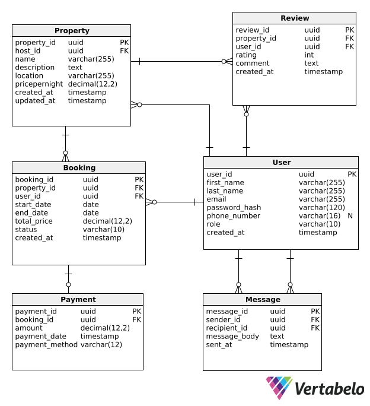

# Database Design

The following diagram represents the physical database model designed in Vertabelo:

### Entities

- User
- Property
- Booking
- Payment
- Review
- Message

### Relationships

- User to Booking (one to many)
- Property to Booking (one to many)
- Booking to Payment (one to one)
- User to Property (one to many)
- Property to Review (one to many)
- User to Review (one to many)
- User(Sender) to Message (one to many)
- User(Recipient) to Message (one to many)
